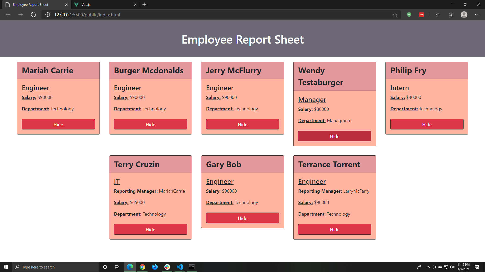
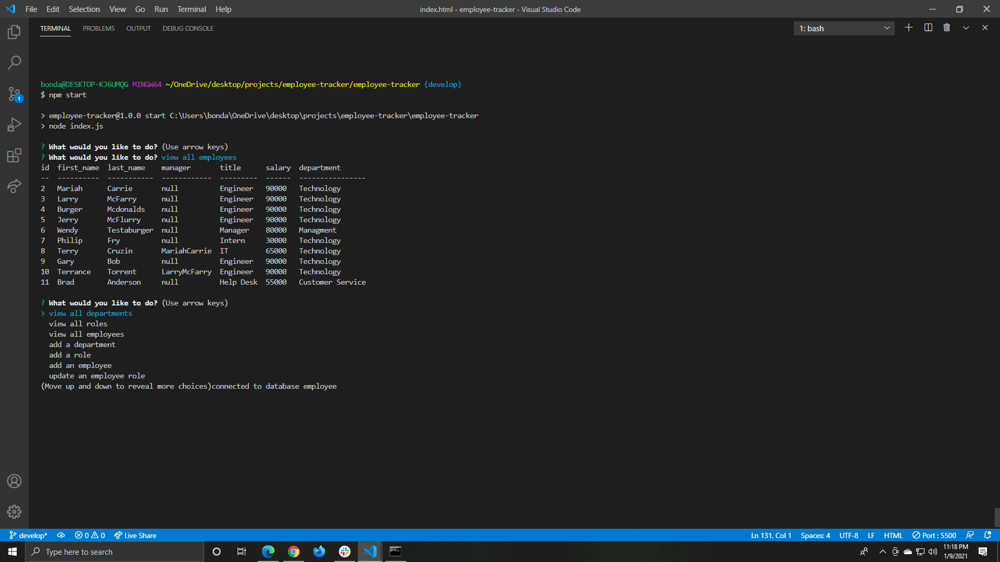

# Employee-Tracker
## Description
This is a Report Generator! The application takes the CRUD commands you give it from the commandline and updates a database accordingly. When the user Selects Print from the list of options, the index.html file inside of the public folder will be updated with a report of your current employees. You may select to remove certain elements from inside of the Report page with the "Hide" button.

## Video Demo 
https://drive.google.com/file/d/1unt3O3eWPD_2tpEIFjvIWXd2l1dPhZFg/view

## How To Use 
If you do not have mysql installed, please be sure to go the mysql website, download and install.  
  
1: Run "npm init" and then "mysql -u root -p" and then enter your password.  
2: Inside of the mysql command shell, type "SOURCE schema.sql" and then "SOURCE seeds.sql".  
    ALTERNATE: Drag the schema.sql, and seeds.sql files into your workbench and execute them from there.  
3: Exit you mysql command shell.  
4: Type "npm start" to begin the app.  
    ALTERNATE: Run "node index.js".  
5: To view the results from "print" go to the index.html file inside of the "public" folder, and open as either a live server, or a static page.  
6: Select "exit" when you are ready to leave the command shell.  

## ScreenShots 

## Future Development
I would like to add more update functions to the command line prompts for the database.  
I would also like to give the index.html page more interaction. Including the ability to modify the Database directly.

## Licenses
MIT

## Technology
Javascript  
JQuery  
NODE.js  
MYSQL  
MYSQL2  
Inquirer